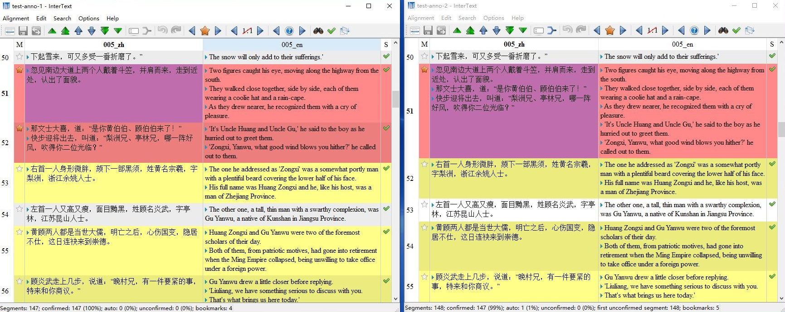

# MAC

MAC is a manually aligned Chinese-English parallel corpus of  literary texts, consisting of chapters sampled from six Chinese novels and their English translations.

Although MAC is initially created for evaluating the performance of automatic sentence aligners such as [Gale-Church](https://aclanthology.org/J93-1004/), [Hunalign](http://mokk.bme.hu/en/resources/hunalign/), [Belualign](https://github.com/rsennrich/Bleualign), [Vecalign](https://github.com/thompsonb/vecalign) and [Bertalign](https://github.com/bfsujason/bertalign),  the corpus can also be used in the study of contrastive linguistics, the difference between translated v.s. non-translated language and translation strategies, etc.

## Makeup and Statistics

The novels in MAC are selected from a range of different genres and for each novel, five chapters are sampled from the beginning, middle and end of the book. We then take one chapter from each novel and construct a development set [MAC-Dev](./dev). The remaining chapters make up [MAC-Test](./test).

Please check  [Dev-metadata](./dev/meta_data.tsv) and [Test-metadata](./test/meta_data.tsv) for more information about the development and test set.

##### Table 1. Makeup of MAC

| Genre        | Book_Title | Author | Trans_Title                    | Translator                     |
| ------------ | ---------- | ------ | ------------------------------ | ------------------------------ |
| Humor        | 黄金时代       | 王小波    | The Golden Age                 | Hongling Zhang; Jason Sommer   |
| Martial Arts | 鹿鼎记        | 金庸     | The Deer and The Cauldron      | John Minford                   |
| Classic      | 红楼梦        | 曹雪芹    | The Story of the Stone         | David Hawkes                   |
| War          | 红高粱        | 莫言     | Red Sorghum                    | Howard Goldblatt               |
| Romance      | 长恨歌        | 王安忆    | The Song of Everlasting Sorrow | Michael Berry; Susan Chan Egan |
| Sci-fi       | 三体         | 刘慈欣    | The Three-Body Problem         | Ken Liu                        |

##### Table 2. Statistics of MAC

| Data     | # Src_Sents | # Tgt_Sents | # Src_Tokens | # Tgt_Tokens | # 1-1 (%)    |
| -------- |:----------- | ----------- | ------------ | ------------ | ------------ |
| MAC-Dev  | 1,444       | 1,947       | 21,911       | 31,374       | 817 (61.5)   |
| MAC-Test | 4,799       | 6,573       | 73,635       | 105,407      | 2,628 (59.8) |
| Total    | 6,243       | 8,520       | 95,546       | 136,781      | 3,445 (60.2) |

## Manual Alignment and Inter-Coder Agreement

The bilingual texts in MAC are split into sentences and aligned at sentence level using the manual alignment tool [InterText](https://wanthalf.saga.cz/intertext).

The manual alignment was made by two annotators to ensure accuracy and reliability. The hand-checked alignments are saved in the directory [intertext_01](./test/intertext_01) for the first annotator and [intertext_02](./test/intertext_02) for the second annotator.

We use the Python script [mark_disagreement.py](./mark_disagreement.py) to mark up any differences between two annotators:

```bash
python mark_disagreement.py -a1 test/intertext_01/test-anno-1.001_zh.001_en.xml -a2 test/intertext_02/test-anno-2.001_zh.001_en.xml 
```



##### Figure 1. Markup of Annotator Differences

The observed differences are then resolved through discussions between the annotators. We found that many disagreements can be attributed to various translation techniques (e.g., omission, addition and sentence inversion) employed by translators to make the target texts more adequate and fluent.

All the cases of annotator differences and the corresponding resolutions have been recorded in an Excel file [anno_disagreement.xlsx](./test/anno_disagreement.xlsx). The final alignments verified by both annotators are saved in the directory [dev/Intertext](./dev/Intertext) and [test/Intertext](./test/Intertext).

We use the script [compute_ica.py](./compute_ica.py), which implements the set-based metric Jaccard Index as suggested by Artstein & Poesio (2008), to measure the Inter-Coder Agreement (ICA):

```bash
python compute_ica.py -a1 test/intertext_01 -a2 test/intertext_02
```

## TSV Format

To facilitate follow-up search and annotation of parallel corpus, you can run the Python script [intertext2tsv.py](./intertext2tsv.py) to convert Intertext XML files into TSV format:

```bash
python intertext2tsv.py -i test/intertext -o test/tsv
```

The bilingual corpus in TSV format will be saved in the [tsv directory](./test/tsv).

## References

Artstein, R., & Poesio, M. (2008). Inter-coder agreement for computational linguistics. *Computational linguistics*, *34*(4), 555-596.
